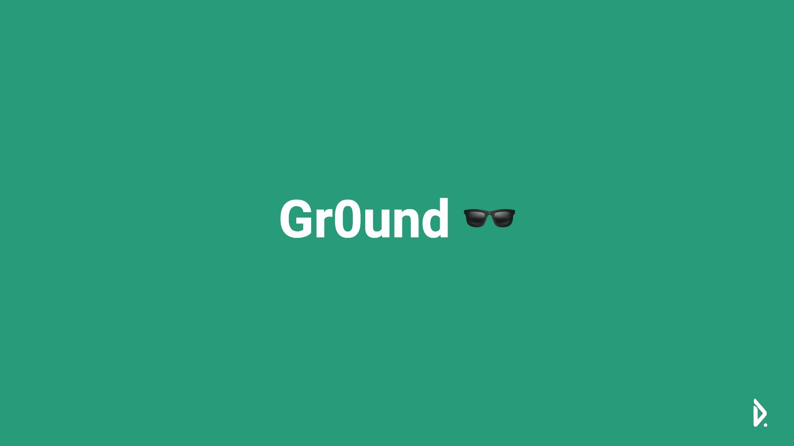

# gr0und-front
그라운드, 독립 메타버스 플랫폼. 웹 기반 low-level 메타버스 프로젝트

## Goal
그라운드 프로젝트는 메타버스 시스템의 중앙 집중화를 해결하기 위해 개발되었습니다. 다른 플랫폼처럼 설치형이 아닌 웹 기반으로 누구나 손쉽게 이용할 수 있다는 장점이 있습니다.

## To-Do

* [x] [ 개발 ] 스무더 그라운드 분할
* [x] [ 개발 ] Player class 화
* [x] [ 개발 ] socket io realtime
* [x] [ 개발 ] 하늘 생성
* [x] [ 개발 ] 바닥 텍스쳐
* [x] [ 개발 ] 신규 접속 시 유저 정보 가져오기
* [x] [ 개발 ] 콘크리트 마찰 설정
* [ ] [ 개발 ] 동시 플레이어 움직임 버그 해결
* [ ] [ 개발 ] 점프 이동 속도문제 해결
* [ ] [ 개발 ] 계단 오르기 및 언덕 오르내리기
